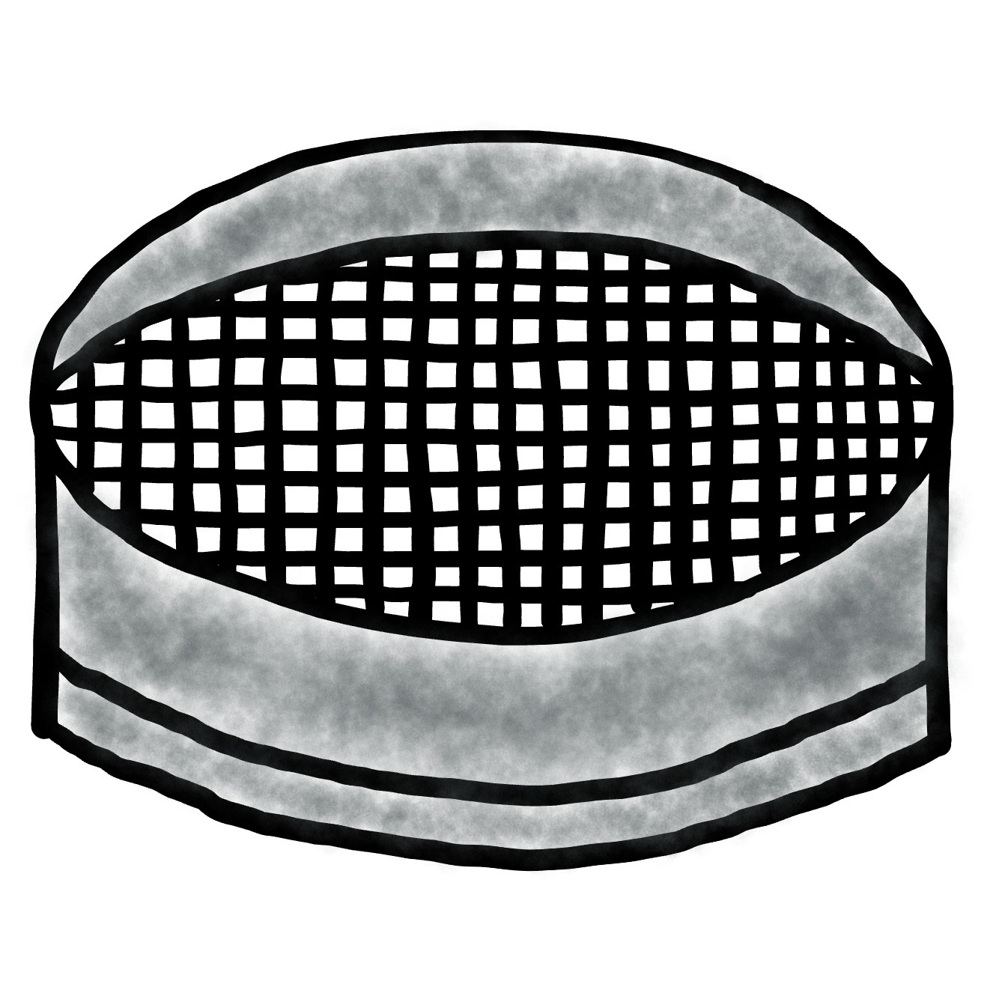

# Sieve — Local AI Image Detector for Chrome

A Manifest V3 Chrome extension that detects AI-generated images **entirely on-device**.
No cloud inference, no external APIs, no local server. Images never leave your browser.

Winner of the [poidh local-AI challenge](https://poidh.xyz/arbitrum/bounty/323). MIT licensed,
and actively improved from user reports — see the issue tracker.

## Results

Held-out proxy benchmark: 36,384 images — SynthBuster (9 commercial 2023 generators,
never trained on), OpenFake test (2026 frontier: GPT Image 2, Midjourney v7,
Nano Banana Pro, Flux.2, …), OpenFake reddit (in-the-wild, never trained on),
COCO val2017 + OpenFake reals. Scored at the fixed **0.65** confidence threshold.

| condition | balanced accuracy | AI recall | real-photo accuracy |
|---|---|---|---|
| clean | **91.2%** | 85.4% | 97.1% |
| web (≤768px, JPEG q60) | **87.1%** | 77.8% | 96.4% |
| hard (≤512px, JPEG q40) | **86.1%** | 77.1% | 95.0% |

For reference, the stock Community Forensics base model scores 75.8 / 65.9 / 56.5
under the same protocol (its detection rate on GPT Image 2 is 7%; ours is >90%).
Inference: ~91ms/image end-to-end (WebGPU, Apple Silicon), ~30ms model time.

## How it works

- A content script finds images on the page as they approach the viewport
  (IntersectionObserver + MutationObserver for dynamic content).
- The extension service worker orchestrates a queue with caching; an offscreen
  document fetches image bytes (host permissions bypass CORS, usually a browser
  cache hit), decodes, and preprocesses them.
- Preprocessing is **deterministic and browser-independent**: images decode
  1:1 (a startup probe verifies the canvas readback byte-exactly and switches
  to WebCodecs if the browser injects fingerprinting noise), and resizing uses
  Sieve's own Pillow-exact resampler — so scores match the Python benchmark
  pipeline on every browser.
- Inference runs in ONNX Runtime Web on **WebGPU**, falling back to
  **WASM (SIMD)** — including automatically when a numerical self-test detects
  a GPU stack computing the model incorrectly. The model is a ViT-S/16
  initialized from [Community Forensics](https://github.com/JeongsooP/Community-Forensics)
  (Park & Owens, CVPR 2025, MIT), fine-tuned on modern generator outputs
  (GPT Image, Midjourney v7, Flux, Nano Banana, …) with web-realistic
  degradation augmentation (JPEG/WebP recompression, rescaling, thumbnail
  regime), dedicated small-resolution copies of scale-fragile generators,
  and hard-real categories sourced from user reports and audits
  (screenshots, cartoon frames, game art, YouTube thumbnail composites,
  movie posters, product photos, degraded/low-quality photos, retouched
  portraits). Shipped weights are a **weight average of two identically
  trained runs**, which stabilizes borderline scores across releases.
- Borderline images (calibrated 25–85%) get a second, native-resolution
  inference pass (selective TTA) and average the two views.
- Every analyzed image gets a confidence badge: red **AI n%** at or above the
  threshold (default **65%**, optionally blurred — click to toggle), amber
  **unsure n%** just below it, quiet gray otherwise.
- Wrong verdict? Right-click → *Sieve: report misclassification* pre-fills a
  GitHub issue with the image URL and Sieve's score — reported images become
  regression tests and training categories for the next model.
- Model weights (~45 MB) are downloaded **once** during setup from a pinned,
  checksummed URL and stored in OPFS; the extension then runs fully offline.
  When an update ships a newer pinned model, Sieve prompts — downloads are
  always user-initiated. The popup shows exactly which weights are installed.

## Install (from source)

Requirements: Node.js ≥ 20, Chrome ≥ 124.

```bash
cd extension
npm install       # pulls onnxruntime-web (pinned)
npm run build     # copies the ORT runtime into extension/vendor/ort/
```

Then:

1. Open `chrome://extensions`, enable **Developer mode**.
2. **Load unpacked** → select the `extension/` directory.
3. The setup tab opens automatically (or click the extension icon → *Model setup*).
   Press **Download model** and wait for "Sieve is active".
4. Browse. Badges appear on analyzed images; the popup shows per-page stats
   and lets you adjust the threshold (bounty evaluation: 65%).

## Reproducing the model

The pipeline is plain PyTorch and runs on any CUDA machine
(`training/standalone/`, no cloud service required):

```bash
python -m venv venv && . venv/bin/activate
pip install torch torchvision timm pillow numpy pyarrow huggingface_hub requests onnx
cd training/standalone
export DATA=~/data SCRATCH=/scratch
python materialize_eval.py          # benchmark: SynthBuster, COCO, OpenFake test/reddit
python materialize_train.py         # OpenFake train subset, COCO train, WikiArt
python materialize_screenshots.py   # hard-real screenshots (+ --synth-url tar)
python materialize_cartoons.py      # hard-real categories (cartoons, posters, product, degraded) + AI-art positives
python materialize_small.py         # downscaled copies of scale-fragile generator positives
python train.py --run-name ft --max-steps 4500 --thumb-p 0.35 \
    --train-manifests openfake_train,coco_train,wikiart,screenshots_train,cartoons_train,small_pos
python soup_pt.py --ckpts a/best.pt,b/best.pt --out soup/best.pt   # average two runs
python eval_logits.py --ckpt soup/best.pt --tag ft                 # clean/web/hard logits
python export_fp16.py --ckpt soup/best.pt --out model_fp16.onnx    # fp16, fp32 I/O
```

Calibration (the manifest's `bias`) is fit offline from the logit CSVs:
maximize worst-tier balanced accuracy at the fixed 0.65 threshold subject to
real-photo accuracy ≥ 95%. Datasets are used under their respective licenses
and are not redistributed with this repository.

## Repository layout

```
extension/            the Chrome extension (load this directory unpacked)
  src/                service worker, offscreen inference, content script, UI
  vendor/ort/         ONNX Runtime Web (copied by npm run build, not committed)
  model_manifest.json pinned model URL + sha256 + calibration constants
training/standalone/  dataset materializers, fine-tune, soup, eval, ONNX export
training/vendor/      Community Forensics model code (MIT, J. Park)
eval/e2e/             browser end-to-end suites: scoring harness, badge/mode/
                      leak/update tests, PIL-parity regression
tools/                report mining (GitHub issue parser + labeling), PIL reference scorer
```

## License

MIT. Vendored Community Forensics code is MIT (Copyright Jeongsoo Park).
ONNX Runtime Web is MIT (Microsoft).
